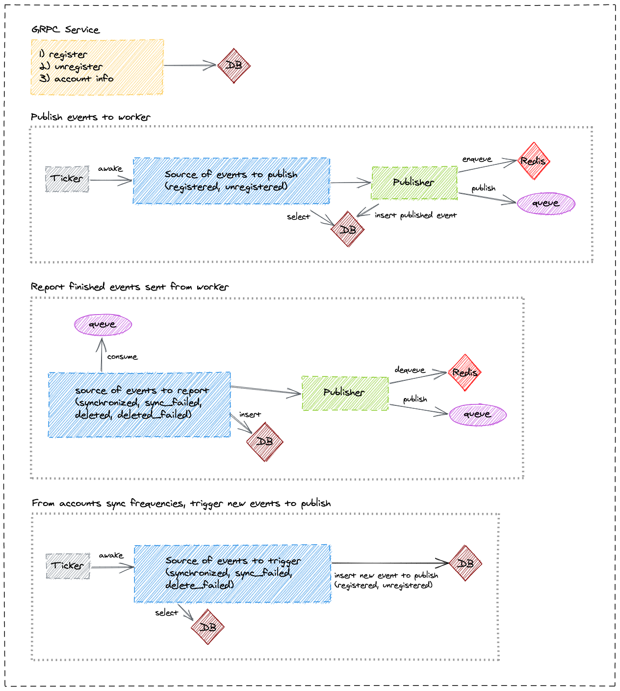

# Lama - Account Manager

## Getting started
1. Install [sbt][sbt]
2. Install [PostgreSQL][postgresql] and configure access for user `lama` and password `serge` (default user and password from `src/main/resources/application.conf`)
3. Create database `lama` and give access to the configured user
4. Apply migration (see [Database migration][database-migration])
5. Install [RabbitMQ][rabbitmq] and configure access for user `lama` and password `serge` (default user and password from `src/main/resources/application.conf`)
6. Install [Redis][redis] with the default configuration

## Run the account manager

> A shared `build.sbt` file is used at the root of the lama project to share common libraries and handle multiple sub projects.
>
>All following sbt commands should be done at the root path of the lama project.

Run the app: `sbt accountManager/run`

### Database migration

The project uses [flywayt-sbt][flywayt-sbt] to migrate sql scripts in the folder `src/main/resources/db/migration`.

Migrate your database using `sbt accountManager/flywayMigrate` or clean it using `sbt accountManager/flywayClean`.

### Testing

#### Unit tests
`sbt accountManager/test`

#### Integration tests
- Create the `test-lama` database

`psql -h localhost -p 15432 -U lama -c "CREATE DATABASE test-lama"`

- Run tests

`sbt accountManager/it:test`

## Docker

The plugin [sbt-docker][sbt-docker] is used to build, run and publish the docker image.

The plugin provides these useful commands:

- `sbt accountManager/docker`:
Builds an image.

- `sbt accountManager/docker:stage`:
Generates a directory with the Dockerfile and environment prepared for creating a Docker image.

- `sbt accountManager/docker:publishLocal`:
Builds an image using the local Docker server.

- `sbt accountManager/docker:publish`
Builds an image using the local Docker server, and pushes it to the configured remote repository.

- `sbt accountManager/docker:clean`
Removes the built image from the local Docker server.

[sbt]: http://www.scala-sbt.org/1.x/docs/Setup.html
[postgresql]: https://www.postgresql.org/download/
[flywayt-sbt]: https://github.com/flyway/flyway-sbt
[rabbitmq]: https://www.rabbitmq.com/download.html
[redis]: https://redis.io/download
[sbt-docker]: https://github.com/marcuslonnberg/sbt-docker
[database-migration]: #database-migration
