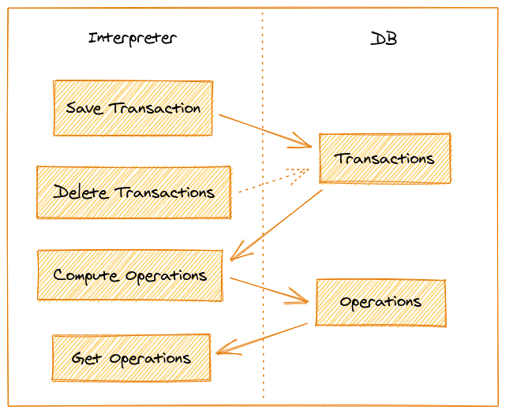

# Lama - Bitcoin interpreter

## Features

### Save Transactions

This will upsert all blocks and transactions with their inputs and outputs in DB for this user.
If another user is synchronised and is also present in the same transaction, the transaction will be saved twice, one for each user.

### Compute Operations

When an account has finished synching with the explorer we know for sure that all his used addresses are known, 
and all transactions from this account have been saved. We can compute his operations.

You need to provide the list of all known addresses from this account and his accountId and all transactions that have not yet been computed into operations will be computed.
An operation is the "account view" of a transaction. If your account is an ouput of a transaction, the total amount send to your your account will be considered "RECEIVED".

### Get Operations

Send all "operations" in a paginated response.

## Getting started
1. Install [sbt][sbt]
2. Install [postregsql][postregsql] and configure access for user `lama` and password `serge` (default user and password from `src/main/resources/application.conf`)

## Run the bitcoin interpreter

> A shared `build.sbt` file is used at the root of the lama project to share common libraries and handle multiple sub projects.
>
>All following sbt commands should be done at the root path of the lama project.

Run the app: `sbt btcInterpreter/run`

### Testing

`sbt btcInterpreter/test`

`sbt btcInterpreter/it:test`

## Docker

The plugin [sbt-docker][sbt-docker] is used to build, run and publish the docker image.

The plugin provides these useful commands:

- `sbt btcInterpreter/docker`:
Builds an image.

- `sbt btcInterpreter/docker:stage`:
Generates a directory with the Dockerfile and environment prepared for creating a Docker image.

- `sbt btcInterpreter/docker:publishLocal`:
Builds an image using the local Docker server.

- `sbt btcInterpreter/docker:publish`
Builds an image using the local Docker server, and pushes it to the configured remote repository.

- `sbt btcInterpreter/docker:clean`
Removes the built image from the local Docker server.

[sbt]: http://www.scala-sbt.org/1.x/docs/Setup.html
[postregsql]: https://www.postgresql.org/
[sbt-docker]: https://github.com/marcuslonnberg/sbt-docker
