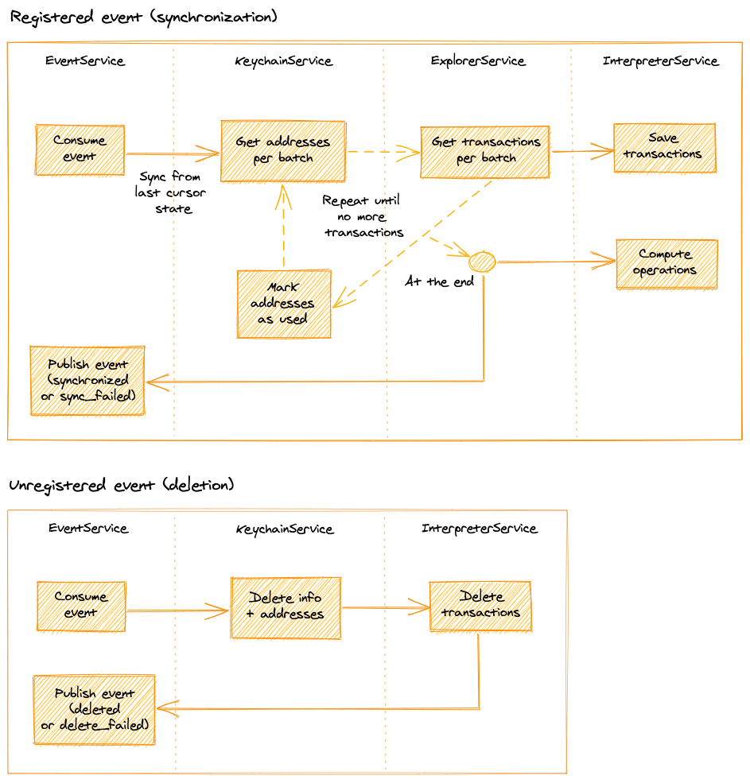

# Lama - Bitcoin worker

## Getting started
1. Install [sbt][sbt]
2. Install [RabbitMQ][rabbitmq] and configure access for user `lama` and password `serge` (default user and password from `src/main/resources/application.conf`)

## Run the bitcoin worker

> A shared `build.sbt` file is used at the root of the lama project to share common libraries and handle multiple sub projects.
>
>All following sbt commands should be done at the root path of the lama project.

Run the app: `sbt btcWorker/run`

### Testing

`sbt btcWorker/it:test`

## Docker

The plugin [sbt-docker][sbt-docker] is used to build, run and publish the docker image.

The plugin provides these useful commands:

- `sbt btcWorker/docker`:
Builds an image.

- `sbt btcWorker/docker:stage`:
Generates a directory with the Dockerfile and environment prepared for creating a Docker image.

- `sbt btcWorker/docker:publishLocal`:
Builds an image using the local Docker server.

- `sbt btcWorker/docker:publish`
Builds an image using the local Docker server, and pushes it to the configured remote repository.

- `sbt btcWorker/docker:clean`
Removes the built image from the local Docker server.

[sbt]: http://www.scala-sbt.org/1.x/docs/Setup.html
[rabbitmq]: https://www.rabbitmq.com/download.html
[sbt-docker]: https://github.com/marcuslonnberg/sbt-docker